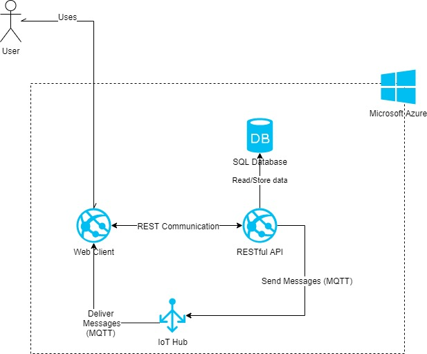

# Introduction
This project is the result of an implementation for Assignment 1: "The API and the Front-End Consumer". The idea is to design a web application named "Shared ToDo App" which manages a simple shared ToDo list. Such website consumes an API with two protocols: HTTPS RESTful and MQTT.

The first protocol (HTTPS RESTful) is responsible for carriying out CRUD operations, persisting new ToDo tasks, updating, deleting and getting them.
The later protocol (MQTT) is responsible for real-time notifications to share operations made over the shared ToDo list, notifying additions, updatings and deletions.

# Architecture
The architecture of the system is based on Microsoft Azure services:
- 2 Azure App Services
- 1 Azure SQL instance
- 1 IoT Hub

The following figure shows a diagram of the architecture.

System data will be stored on **Azure SQL**.

One of the **Azure App Services** hosts the API project which performs all the business logic, storing the data on the Azure SQL instance. This application also sends messages to the IoT Hub when a task is added, updated or deleted. This App Service is configured with Tomcat 9.0 and Java 8.0.

The second **Azure App Service** hosts a front-end web application which communicates with the API using RESTful requests and receives messages from the IoT Hub, showing them on the UI. This application is the main interface for the user to manage the shared ToDo list. This App Service is also configured with Tomcat 9.0 and Java 8.0.

The **Azure IoT Hub** is responsible of real-time mesage communication over MQTT between the API and the Front-end.

The Azure App Services can be **scaled** both hotizontally and vertically, having a load-balancer in front of them, what allows more concurrency if needed.

The same applies to the IoT Hub which can be scaled adding more partitions in case of need and to the Azure SQL instance which can be dynamically powered up if more resources are required.

# Implementation
The system is composed of two projects: one to implement the API and the other one to implement the Front-End Web Client.

## API Project
This project implements the main API of the system. It is a Web Application written in Java 8, based on Jersey Framework (implementation of JAX-RS) and optimized to run on Tomcat.

Jersey Framework (Container) helps to build the **RESTful API**, providing mechanisms to handle  HTTP request, its verbs and parsing of data. Thus we only need a controller class to implement the actions provided to consumers: getAll, getById, create, update and delete. This API is secured by a basic token system using the "Authorization" HTTP Header.

"Create", "update" and "delete" actions raise events that are handled by observers in the IoT module which process those events and deliver a consequent **MQTT** message to Azure IoT using a specific class to achieve this through Aure IoT SDK.

The events are raised through a custom implementation of "observer/observable" pattern based on **"hook"** concept. This implementation totally decouples the observer and observable objects; therefore, there is no need they know each other. The observer just subscribes to a string that identifies the event. The observable just raises the event using its string name.

For data storing we have a repository which uses Hibernate 5 as DAO and ORM and manages data model, retrieving, deleting and persisting data on Azure SQL.

## Webclient Project
Here is implemented the Front-end Web Client which consumes the API and provides a UI to the users to manage the application. This is a Java 8 Spring MVC based project (yes, once again...) to help the implementation of UI-Server communication.

The UI communicates with the Server calling RESTful actions from a local controller. This actions consume the remote RESTful API through a repository (**consumer**) that uses Spring RestTemplate as DAO (actual API consumer).

To receive real-time messages from Azure IoT Hub there is a class that implements a **MQTT IoT Receiver** through Azure IoT Hub SDK. This class is **Observable** providing a mechanism to deliver the message to other modules of the application.

To send real-time messages received from MQTT interface to the UI we use **WebSockets**. There is an implementation of a collection of WebSocketsClients that are created and added to the collection whenever a web client connects to our WebSocket end point. This collection is an **Observer** of the IoT Receiver. In this way, each time the IoT Receiver receives a message, it is delivered to the WebSocketClients collection and then delivered to the WebSocket clients through their sessions.

The UI is a SPA implemented using AngularJS for beheavior and Bootstrap 3 for layout. This UI allows the user to get, create, update and delete ToDo tasks. Along with the capability to, dynamically and consequentlly, append, remove or update tasks on the current task list when a WebSocket message is received.

# Conclusions
This application demonstrates how to implement a Java API that provides two interfaces: RESTful HTTP and MQTT. In addition, it demonstrates how to consume both interfaces by another Java Web Application which involves REST, MQTT and WebSocket consuming.

You can see and test a real implementation of the system deployed to Microsoft Azure on https://jrjfexcowebclient.azurewebsites.net.

This project can be configured into a **SDLC Jenkins automation process**, connecting the GitHub repository to extract code, passing tests, compiling, packing and deploying directly to Azure App Services.
